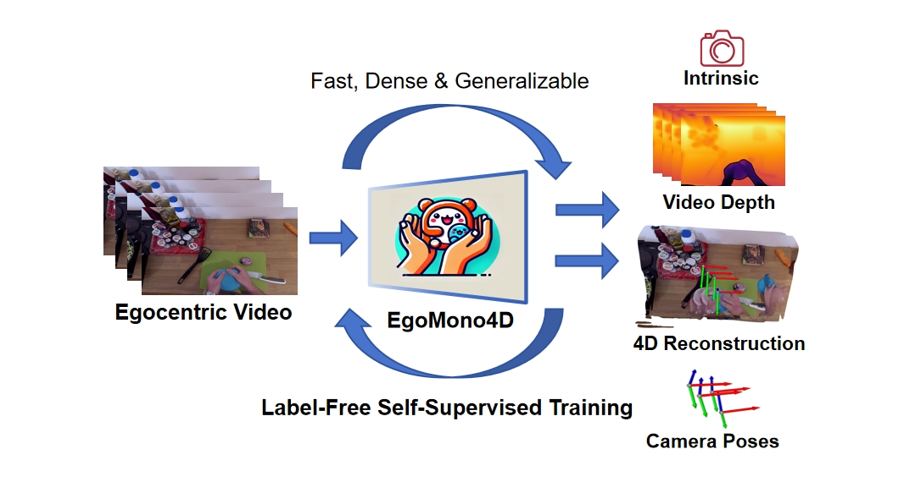
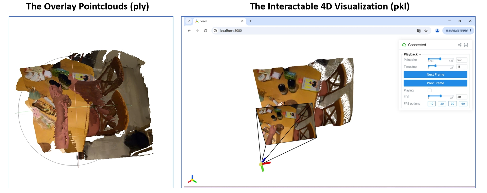

# EgoMono4D: Self-Supervised Monocular 4D Scene Reconstruction for Egocentric Videos

**[Chengbo Yuan](https://michaelyuancb.github.io/), [Geng Chen](https://jc043.github.io/), [Li Yi](https://ericyi.github.io/), [Yang Gao](https://yang-gao.weebly.com/).**

**[[Project Website](https://egomono4d.github.io/)] [[Arxiv](https://arxiv.org/abs/2411.09145)] [[BibTex](#jump)]**

EgoMono4D is an early exploration to **apply self-supervised learning for generalizable 4D pointclouds sequence reconstruction** to the label-scarce egocentric field, enabling fast and dense reconstruction. Different from some supervised methods like [DUSt3R](https://dust3r.europe.naverlabs.com/) or [MonSt3R](https://monst3r-project.github.io/), it is trained solely on large-scale unlabeled video datasets, representing a new paradigm for 4D reconstrucion. 



## Installation

First build the basic environment: 
```
conda create -n egomono4d python=3.11
conda activate egomono4d
conda install -y pytorch==2.0.1 torchvision==0.15.0 cudatoolkit=11.7 -c pytorch -c nvidia
```

Our project is based on [UniDepth](https://github.com/lpiccinelli-eth/UniDepth) and [CoTrackerV2](https://github.com/facebookresearch/co-tracker/tree/cotracker2v1_release). Please then install these two repositories locally. After that, please run the following commands:
```
pip install -r requirement.txt
pip install kaolin==0.16.0 -f https://nvidia-kaolin.s3.us-east-2.amazonaws.com/torch-2.0.1_cu117.html
pip install evo --upgrade --no-binary evo
```

Finally, we manage the checkpoints of the off-the-shelf models together in a cache folder. The default directory is ```./cache```, which could be changed in the configuration file. The structure of the folder should be:

```
- cache
   - cotracker_checkpoints
      - cotracker2.pth
   - data_custom
   - gmflow_checkpoints
      - gmflow-scale1-mixdata-train320x576-4c3a6e9a.pth
   - models
   - unidepth_v2_checkpoints
      - unidepth-v2-vitl14.bin
      - unidepth-v2-vitl14.json
```

Please download these checkpoints / weights and put them into the correct directory. 

## Getting Start

To run the example of EgoMono4D, first download the **[pretrain weight](https://drive.google.com/file/d/1aEiXgdCX2LfQydIkPQroGlIvYNPyY01M/view?usp=sharing)** (ptr_all_350k) and put it in ``./cache/models``. Then run the below command: 

```
INFER_MODE=True python -m egomono4d.inference_demo -m cache/models/ptr_all_350k -f examples/example_epic_kitchen
```

This will conduct EgoMono4D prediction and generate two result files (``result_example_epic_kitchen.ply`` and ``result_example_epic_kitchen.pkl``) automatically. The ``ply`` file is the overlay pointclouds of all frames, which could be opened with software like [MeshLab](https://www.meshlab.net/). The ``pkl`` file is a pickle file containing a dict with:

```
result = {
    "xyzs": xyzs,               # (f, h, w, 3)
    "rgbs": rgbs,               # (f, h, w, 3)
    "depths": deps,             # (f, h, w),    depths used to recover point clouds. 
    "intrinsics": intrinsics,   # (f, 3, 3),    pixel2camera intrinsic
    "extrinsics": extrinsics,   # (f, 4, 4),    camera2world extrinsics
    "flys": fly_masks,          # (f, h, w),    flys of depths
    "weights": weight_msk,      # (f-1, h, w),  confident masks
}
```

We provide a script for 4D visualization. Please run: 
```
python -m egomono4d.demo_viser -f result_example_epic_kitchen.pkl
``` 
and then open ``http://localhost:8080/`` in your browser. An interactable GUI for will be available for better 4D result visualization.



## Model Training

For model training and evaluation, we need to first pre-process the datasets. The data pre-process depends on [EgoHOS](https://github.com/owenzlz/EgoHOS) model. Please first install the repository locally and put the checkpoints of EgoHOS (the ``work_dirs`` folder from EgoHOS official) to ``./cache/ego_hos_checkpoints``.

To start model traninig and evaluation, we need to first process the datasets. We manage the un-processed orginal datasets in ``./cache/original_datasets`` and the processed datasets in ``./cache/processed_datasets``. Please download the datasets below to ``./cache/original_datasets``.

|  Datasets   | Utilization  | Download URL |
|  ----  |  ----  |  ----  |
| HOI4D | train & eval | [link](https://hoi4d.github.io/) |
| H2O | train & eval | [link](https://taeinkwon.com/projects/h2o/) |
| FPHA | train | [link](https://guiggh.github.io/publications/first-person-hands/) |
| EgoPAT3D | train | [link](https://ai4ce.github.io/EgoPAT3D/) |
| Epic-Kitchen | train | [link](https://epic-kitchens.github.io/2021) |
| ARCTIC | eval | [link](https://arctic.is.tue.mpg.de/) |
| POV-Surgery |  eval | [link](https://batfacewayne.github.io/POV_Surgery_io/) |

For datasets pre-process, it will automaically conducts for the first time we start the training scripts. If we want to process each datasets manually, we could first change the configuration file in ``./egomono4d/datagen.py`` and run ``python -m egomono4d.datagen``. For example, if we want to process Epic-Kitchen independently, we could first change **Line28** of ``datagen.py`` as ``config_name="datagen_pov_surgery`` and then run ``python -m egomono4d.datagen``.

More details could be found in ``./config`` and ``./egomono4d/datagen.py``. The processed results will be saved in ``./cache/processed_datasets`` automatically. After data pre-process, we could start the traning with:

```
python -m egomono4d.pretrain wandb.name=egomono4d_train
```

The training results will be saved in ``./cache/models``.

## Evaluation

For evaluation, please run: 

```
python -m egomono4d.evaluation -f $MODEL_FOLDER -b $BATCH_SIZE -c $CONFIG_PATH
``` 

where ``$MODEL_FOLDER`` is the folder of model checkpoints, ``$CONFIG_PATH`` is the path of evaluation configuration file, which could be found in ``./config`` (e.g. ``./config/pretrain_eval_hoi4d.yaml``). The evaluation results will be saved in a json file. 

## Acknowledgment

This repository is based on the code from [FlowMap](https://github.com/dcharatan/flowmap), [EgoHOI](https://github.com/michaelyuancb/ego_hoi_model), [UniDepth](https://github.com/lpiccinelli-eth/UniDepth) and [Viser](https://github.com/nerfstudio-project/viser). We sincerely appreciate their contribution to the open-source community, which have significantly supported this project.

## Citation

If you find this repository useful, please kindly acknowledge our work <span id="jump">:</span>
```tex
TBD
```


